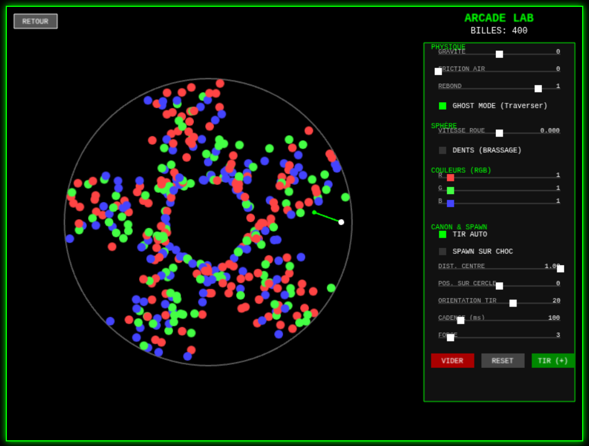

# 🎮 SWICH 974 - La Console Rétro JS

> **🔴 DÉMO EN LIVE : [Jouer à Swich974](https://rodeofly.github.io/swich974/)**

**Swich974** est une collection de mini-jeux d'arcade développés en **JavaScript** avec le framework **Phaser 3**.

Ce projet a été conçu dans un but **éducatif** : il démontre comment structurer un projet de jeu vidéo sans utiliser d'outils complexes (comme Webpack ou Vite), rendant le code accessible aux débutants tout en utilisant des concepts avancés (Héritage, Physique, Mathématiques).



---

## 🕹️ La Ludothèque

Le projet contient maintenant **6 jeux complets**, chacun explorant une mécanique différente :

1.  **BIRDY 974 (Flappy Style)** : Gestion de la gravité et collisions précises.
2.  **T-ZOURIT (Runner Infini)** : Génération procédurale d'obstacles et accélération progressive.
3.  **BRIK BREAKER (Casse-Briques)** : Physique des rebonds, power-ups et gestion de groupes d'objets.
4.  **GENESIS (Jeu de la Vie)** : Manipulation de textures pixel par pixel (Cellular Automata) sans moteur physique.
5.  **ZOURIT ATTACK (Game & Watch)** : Simulation d'un écran LCD rétro avec une boucle de temps saccadée (Tick-based).
6.  **PHYSIQUE LAB (Nouveau !)** : Une simulation de sphère rotative utilisant le moteur **Arcade** détourné pour gérer des collisions circulaires mathématiques et une conservation d'énergie parfaite (rebonds infinis).

---

## 🧠 Concepts Pédagogiques Clés

Si vous apprenez le développement de jeux, voici les parties du code à étudier :

### 1. L'Architecture "Vanilla"
Contrairement aux projets modernes complexes, ce projet charge tout via `index.html`.
* **Pourquoi ?** C'est simple à comprendre. L'ordre des scripts est important : on charge d'abord le moteur, puis les constantes, puis les classes parentes, et enfin les jeux.

### 2. Le Principe "DRY" (Don't Repeat Yourself)
Regardez le fichier `js/scenes/BaseGameScene.js`.
* Toutes les scènes de jeu héritent de cette classe.
* Cela permet de coder le **Bouton Retour** et la logique de transition une seule fois, et tous les jeux en profitent automatiquement.

### 3. Physique Hybride (Arcade + Mathématiques)
Dans `js/scenes/SphereScene.js`, nous n'utilisons pas Matter.js (trop mou pour les rebonds parfaits).
* Nous utilisons **Arcade Physics** pour les collisions entre billes (performances).
* Mais nous calculons manuellement les collisions avec le mur circulaire via des **formules trigonométriques** (car Arcade ne gère pas les cercles creux).
* C'est un excellent exemple de comment contourner les limitations d'un moteur physique.

### 4. Mathématiques & Effets Visuels
Le **Menu Principal** (`js/scenes/MenuScene.js`) n'est pas une simple liste.
* Il utilise les fonctions **Sinus et Cosinus** pour placer les textes sur une roue 3D virtuelle.
* Un effet "Loupe" (Lens Effect) grossit l'élément central en temps réel.

---

## 📂 Structure du Projet

```text
swich-974/
├── index.html           # Point d'entrée (charge les scripts)
├── assets/              # Images et Sons
├── js/
│   ├── main.js          # Configuration globale de Phaser
│   ├── Keys.js          # Dictionnaire des constantes
│   └── scenes/
│       ├── BootScene.js       # Préchargement (Loading Bar)
│       ├── MenuScene.js       # Roue de sélection 3D
│       ├── BaseGameScene.js   # Classe Parente (Héritage)
│       ├── FlappyScene.js     # Logique Flappy Bird
│       ├── RunnerScene.js     # Logique Runner
│       ├── ArkanoidScene.js   # Logique Casse-briques
│       ├── GameOfLifeScene.js # Logique Automate Cellulaire
│       ├── ZouritAttackScene.js # Logique LCD / Game & Watch
│       └── SphereScene.js     # Logique Physique Lab (Arcade Custom)